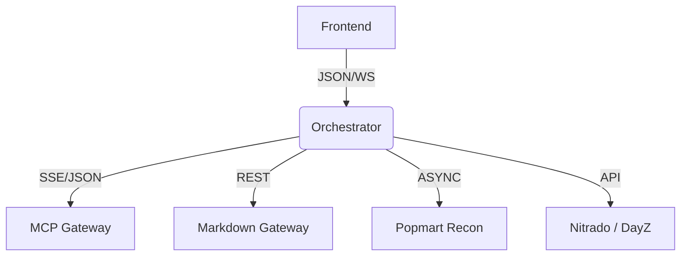

# ⚡ EFFUSION | SERVICES ARCHITECTURE
> **ARCHITECTURE: API-CENTRIC / BFF PATTERN** | **STATUS: OPTIMIZED**

---

## 🟥 SERVICES BREAKDOWN (3X NON-BASELINE)

### 1. THE API NEXUS [STATUS: ONLINE]
All data flows through a unified **Orchestrator** nexus. This Backend-for-Frontend (BFF) pattern decouples the UX from complex sidecar services and protocol-specific bridges.

*   **ORCHESTRATOR:** `orchestrator.py` (FastAPI @ Port 8000)
*   **PROTOCOL:** HTTP / WebSockets / SSE
*   **MISSION:** Service health aggregation, real-time event distribution, and background coordination.

### 2. SERVICE MATRIX
| SERVICE | PORT | TECH | RESPONSIBILITY |
| :--- | :--- | :--- | :--- |
| **Orchestrator** | 8000 | FastAPI | Unified Gateway, WebSocket Hub, Health Monitor. |
| **MCP Gateway**  | 3000 | Node.js | Protocol Bridge, SSE Streaming, Sidecar Ops. |
| **Markdown Gtway**| 8001 | Flask | URL Content Extraction, HTML → Markdown. |
| **Popmart Recon** | N/A | Async Py | PDP Sweeping, CDN Probing, Product Discovery. |
| **DayZ Client**  | N/A | Async Py | Nitrado Integration, RCon, Player Tracking. |

### 3. PREDATORY TOOLING & SIDECARS
*   **FlareSolverr:** Bypassing Cloudflare protection for target recon.
*   **SearXNG:** Aggregating search results for autonomous interrogation.
*   **Readability:** Extracting high-entropy text from noise-heavy HTML.

---

## 🚀 FLOW & LOGIC



## 🛠️ USAGE & DEV LOOP

### 1. Launch the Stack
```bash
docker compose -f docker-compose.yml up -d
```

### 2. Monitor Hub Health
```bash
curl http://localhost:8000/services/health | jq
```

### 3. Integration Testing
```bash
# Start Orchestrator manually for hot-reload
python orchestrator.py
```

---

## 🔒 SECURITY & PATTERNS
*   **Pattern Donors:** Inspired by Kong/Traefik architectures and official FastAPI benchmarks.
*   **Design:** Frontend is **UX ONLY**; no direct backend access from the browser.
*   **Auth:** API Key-ready architecture (Planned Enhancement).

---
*Unified Effusion Framework | Optimized for Autonomous Synthesis.*
